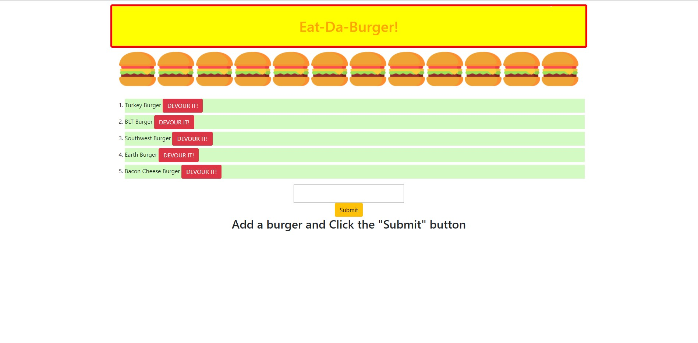
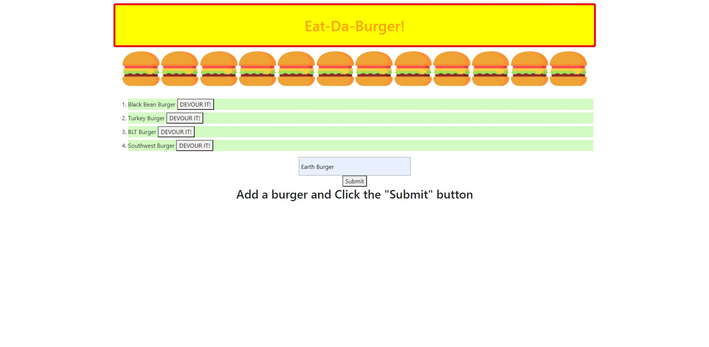
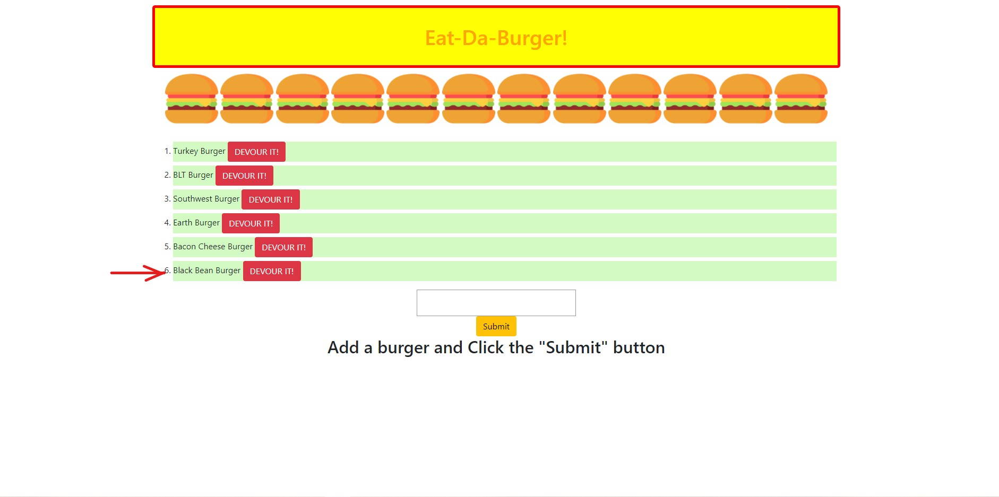

# Eat-Da-Burger  [](https://opensource.org/licenses/MIT)

## Table of Contents
  * [Description](#Description)
  * [User Story](#User-Story)
  * [Contributors](#Contributors)
  * [Language/Technoligies Used](#Language/Technologies-Used)
  * [Mock-Up](#Mock-Up)    
  * [Repository](#Repository-Link)


## Description 


## User Story
```
AS A user, I want to be able to enter a burgers name

I WANT to be able  be able to delete it

SO THAT I they are removed from the current listed burgers
```

## Contributors
Janneth Alvarado Verduzco - janneth_verduzco@live.com

## Language/Technologies Used
* HTML
* CSS
* JavaScript
* package.json- NPM package 
   * Express
   * MySQL
   * Express-Handlebars


## Mock-Up 

### Eet-Da-Burger (WebPage-Layout)


### Name of burger typed


### Burger successfully added


## Deployed Link (Heroku)


## Repository Link
https://github.com/jannverduzco/Eat-Da-Burger